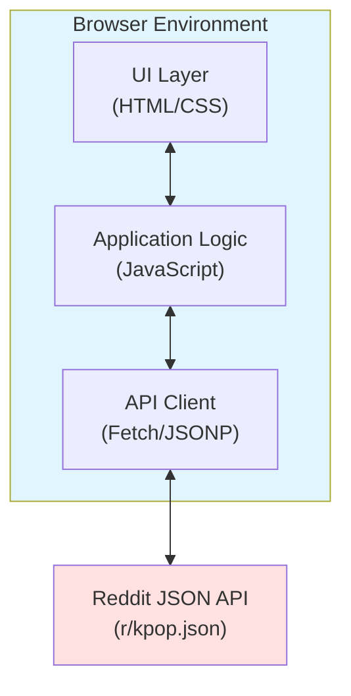
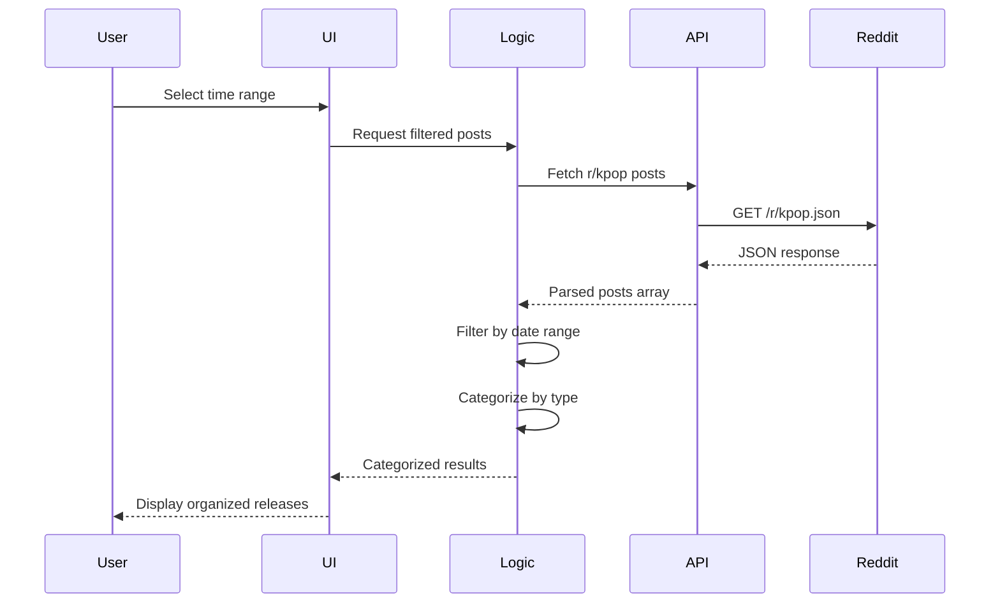

# Design Document: K-pop Releases Tracker

## Overview

The K-pop Releases Tracker is a self-contained, single-file HTML application that fetches and displays K-pop music releases from the r/kpop subreddit. The application provides a browser-based interface for filtering releases by time range and viewing them organized by release type (Music Videos, Albums, Songs).

The design prioritizes simplicity and portability: no build process, no external dependencies, and no server requirements. Users can open the HTML file directly in any modern browser on Mac, iOS, or iPad, making it ideal for distribution via iCloud Drive.

### Key Design Goals

- **Zero Installation**: Single HTML file with embedded CSS and JavaScript
- **Cross-Platform**: Works on Safari (macOS/iOS/iPadOS) and Chrome (macOS)
- **Offline-Ready Structure**: All code embedded; only requires internet for Reddit API calls
- **Touch-Friendly**: Responsive design optimized for both desktop and mobile interactions
- **No Authentication**: Uses Reddit's public JSON API without requiring API keys

## Architecture

### System Architecture

The application follows a simple client-side architecture with three main layers:



### Layer Responsibilities

1. **UI Layer**: Renders the interface, handles user interactions, displays results
2. **Application Logic**: Filters posts by date, categorizes by release type, manages state
3. **API Client**: Fetches data from Reddit, handles CORS, parses JSON responses

### Data Flow



## Components and Interfaces

### 1. HTML Structure Component

**Responsibility**: Provides the semantic structure and layout containers for the application.

**Key Elements**:
- Header with title and description
- Time range selection controls (24h and 7d buttons)
- Results container with sections for each release type
- Error/status message area
- Loading indicator

**Interface**: Static HTML markup with semantic tags and accessibility attributes.

### 2. CSS Styling Component

**Responsibility**: Provides responsive, touch-friendly styling for all screen sizes.

**Key Features**:
- Mobile-first responsive design with media queries
- Touch-friendly button sizes (minimum 44x44px tap targets)
- Rounded corner design for all buttons
- Clear visual hierarchy and spacing
- Smooth transitions for interactive elements
- Print-friendly styles (optional)

**Breakpoints**:
- Mobile: < 768px (single column, stacked layout)
- Tablet: 768px - 1024px (flexible layout)
- Desktop: > 1024px (multi-column where appropriate)

### 3. Reddit API Client

**Responsibility**: Fetches posts from Reddit's public JSON API and handles CORS restrictions.

**Interface**:
```javascript
async function fetchRedditPosts() {
  // Returns: Promise<Array<RedditPost>>
  // Throws: Error if fetch fails
}
```

**Implementation Strategy**:
- Primary: Use CORS proxy (corsproxy.io) to forward requests to Reddit's JSON endpoint
- Endpoint: `https://corsproxy.io/?${encodeURIComponent('https://www.reddit.com/r/kpop.json')}`
- The proxy adds necessary CORS headers to allow browser access from any domain
- Works on GitHub Pages, local files, and any static hosting
- Limit: Fetch up to 100 posts (4 pages of 25 posts each)

**Error Handling**:
- Network errors: Display user-friendly error message
- Invalid JSON: Log error and show parsing failure message
- Rate limiting: Detect 429 status and inform user to wait

### 4. Date Filter Component

**Responsibility**: Filters posts based on selected time range.

**Interface**:
```javascript
function filterPostsByDateRange(posts, startDate, endDate) {
  // Parameters:
  //   posts: Array<RedditPost>
  //   startDate: Date object
  //   endDate: Date object
  // Returns: Array<RedditPost>
}
```

**Time Range Calculations**:
- 24 hours: `now - 24 hours` to `now`
- 7 days: `now - 7 days` to `now`

**Date Comparison**: Uses Unix timestamps from Reddit posts (`created_utc` field).

### 5. Release Categorizer Component

**Responsibility**: Categorizes posts into Music Video, Album, or Song based on flair tags and keywords.

**Interface**:
```javascript
function categorizePost(post) {
  // Parameters: post (RedditPost object)
  // Returns: 'mv' | 'album' | 'song' | 'other'
}
```

**Categorization Logic**:

1. **Flair-Based Detection**:
   - Check `link_flair_text` field for `[MV]`, `[Album]`, `[Audio]`
   - Case-insensitive matching

2. **Category Mapping**:
   - Music Video: Flair contains "MV", "M/V", or "Music Video"
   - Album: Flair contains "Album", "EP", or "Mini"
   - Song: Flair contains "Audio"

3. **Default**: If no match, post is not displayed

### 6. Results Renderer Component

**Responsibility**: Renders categorized posts in the UI with proper formatting and links.

**Interface**:
```javascript
function renderResults(categorizedPosts) {
  // Parameters: categorizedPosts = { mv: [], album: [], song: [] }
  // Returns: void (updates DOM)
}
```

**Rendering Details**:
- Each post displays: Title (as link), Date, Time (in local timezone), Score (optional)
- Links open in new tab (`target="_blank"` with `rel="noopener noreferrer"`)
- Date formatting: Human-readable format (e.g., "Jan 15, 2024")
- Time formatting: 12-hour format with AM/PM (e.g., "3:45 PM")
- Empty state: "No releases found" message when category is empty
- Sections: Separate visual sections for MV, Album, Song

### 7. UI Controller Component

**Responsibility**: Coordinates user interactions and orchestrates data flow between components.

**Key Functions**:
```javascript
// Initialize app on page load - automatically loads 24h results
function initializeApp() { }

// Handle time range button clicks (24h or 7d)
function handleTimeRangeSelection(range) { }

// Main orchestration function
async function loadAndDisplayReleases(startDate, endDate) { }
```

**State Management**:
- Current time range selection (default: 24 hours)
- Fetched posts cache (optional, to avoid redundant API calls)
- Loading state
- Error state

**Initialization Behavior**:
- On page load, automatically fetch and display releases from the last 24 hours
- Show loading indicator during initial fetch
- No user interaction required for default view

## Data Models

### RedditPost

Represents a post from the Reddit API response.

```javascript
{
  title: string,              // Post title
  url: string,                // Reddit post URL
  permalink: string,          // Relative URL path
  created_utc: number,        // Unix timestamp
  link_flair_text: string,    // Flair tag (e.g., "[MV]")
  score: number,              // Upvote count
  author: string,             // Reddit username
  id: string                  // Unique post ID
}
```

### CategorizedPosts

Represents posts organized by release type.

```javascript
{
  mv: Array<RedditPost>,      // Music video posts
  album: Array<RedditPost>,   // Album posts
  song: Array<RedditPost>     // Song posts
}
```

### TimeRange

Represents a date range for filtering.

```javascript
{
  startDate: Date,            // Start of range (inclusive)
  endDate: Date,              // End of range (inclusive)
  label: string               // Human-readable label (e.g., "Last 24 Hours")
}
```


## Correctness Properties

*A property is a characteristic or behavior that should hold true across all valid executions of a system-essentially, a formal statement about what the system should do. Properties serve as the bridge between human-readable specifications and machine-verifiable correctness guarantees.*

### Property 1: Date Range Filtering Correctness

*For any* set of Reddit posts and any date range (start date, end date), when the filter function is applied, all returned posts must have timestamps that fall within the specified range (inclusive), and all posts outside the range must be excluded.

**Validates: Requirements 2.3, 2.4, 7.2**

### Property 2: JSON Response Parsing Completeness

*For any* valid Reddit JSON API response containing post data, when parsed by the tracker, all posts in the response data array must be extracted with their essential fields (title, url, created_utc, link_flair_text) intact and accessible.

**Validates: Requirements 3.3**

### Property 3: Flair-Based Categorization Accuracy

*For any* Reddit post containing a flair tag of "[MV]", "[Album]", or "[Song]" (case-insensitive), the categorization function must return the corresponding category type (Music Video for [MV], Album for [Album], Song for [Song]).

**Validates: Requirements 4.2, 4.3, 4.4**

### Property 4: Keyword-Based Categorization Fallback

*For any* Reddit post without a flair tag, when the post title contains category-specific keywords (e.g., "MV", "Music Video" for Music Video; "Album", "EP" for Album; "Song", "Single" for Song), the categorization function must return the appropriate category based on keyword matching.

**Validates: Requirements 4.5**

### Property 5: Post Rendering Completeness

*For any* categorized Reddit post, when rendered in the results display, the output must include the post title as a clickable hyperlink with the correct Reddit URL, the posting date in human-readable format, and the release type category.

**Validates: Requirements 5.1, 5.2**

### Property 6: User Action Feedback Visibility

*For any* user-initiated action (time range selection, custom date submission, data fetch), the UI must provide immediate visual feedback by updating the interface state (e.g., showing loading indicator, updating results, displaying error messages) within the same browser window.

**Validates: Requirements 9.3**


## Error Handling

### Network Errors

**Scenario**: Reddit API is unreachable or returns network error.

**Handling**:
- Catch fetch errors in try-catch block
- Display user-friendly error message: "Unable to fetch posts from Reddit. Please check your internet connection and try again."
- Log technical error details to console for debugging
- Provide "Retry" button to attempt fetch again

### CORS Errors

**Scenario**: Browser blocks request due to CORS policy.

**Handling**:
- Use CORS proxy (corsproxy.io) to bypass browser restrictions
- The proxy forwards requests to Reddit and adds necessary CORS headers
- Works on GitHub Pages, local files, and any static hosting
- If proxy service is down, display error message with alternative proxy suggestions
- Log technical error details to console for debugging

### JSON Parsing Errors

**Scenario**: Reddit API returns malformed or unexpected JSON structure.

**Handling**:
- Wrap JSON parsing in try-catch
- Validate expected structure (data.children array exists)
- Display error: "Unable to parse Reddit data. The API response format may have changed."
- Log raw response to console for debugging

### Empty Results

**Scenario**: No posts match the selected time range or category.

**Handling**:
- Not an error, but expected edge case
- Display friendly message: "No releases found for the selected time range."
- Suggest trying a different time range
- Show message per category if some categories are empty


### Rate Limiting

**Scenario**: Reddit API returns 429 (Too Many Requests) status.

**Handling**:
- Detect 429 status code
- Display message: "Reddit API rate limit reached. Please wait a few minutes before trying again."
- Optionally show countdown timer if retry-after header is present
- Disable fetch button temporarily

### Browser Compatibility

**Scenario**: User opens in unsupported or very old browser.

**Handling**:
- Use feature detection for critical APIs (fetch, Date, Array methods)
- Display warning if critical features are missing
- Graceful degradation where possible
- Recommend modern browser (Safari 12+, Chrome 80+)

## Testing Strategy

### Overview

The K-pop Releases Tracker will employ a dual testing approach combining unit tests for specific scenarios and property-based tests for universal behaviors. This ensures both concrete edge cases and general correctness are validated.

### Testing Framework Selection

**Property-Based Testing**: Use **fast-check** library for JavaScript property-based testing
- Mature, well-maintained library for JavaScript/TypeScript
- Supports browser and Node.js environments
- Provides rich set of generators (strings, numbers, dates, objects)
- Minimum 100 iterations per property test to ensure thorough coverage

**Unit Testing**: Use **Jest** or browser-native testing
- Jest for Node.js environment testing
- Browser DevTools console for manual integration testing
- Focus on specific examples and edge cases

### Property-Based Tests

Each correctness property from the design document must be implemented as a property-based test with minimum 100 iterations.

#### Property Test 1: Date Range Filtering

**Feature: kpop-releases-tracker, Property 1: For any set of Reddit posts and any date range, filtering returns only posts within range**

```javascript
// Generate random posts with random timestamps
// Generate random date ranges
// Verify all returned posts fall within range
// Verify no posts outside range are included
```

**Generators Needed**:
- Random Reddit post objects with varying timestamps
- Random date ranges (start/end pairs)
- Edge cases: empty arrays, single post, posts at exact boundaries

#### Property Test 2: JSON Parsing

**Feature: kpop-releases-tracker, Property 2: For any valid Reddit JSON response, all posts are extracted with fields intact**

```javascript
// Generate random valid Reddit API response structures
// Parse with tracker's parsing function
// Verify all posts extracted
// Verify essential fields present and correct
```

**Generators Needed**:
- Valid Reddit JSON response structure
- Varying numbers of posts (0 to 100)
- Posts with different field combinations

#### Property Test 3: Flair-Based Categorization

**Feature: kpop-releases-tracker, Property 3: For any post with flair tag, categorization matches flair type**

```javascript
// Generate random posts with [MV], [Album], [Song] flairs
// Test case variations (uppercase, lowercase, with spaces)
// Verify categorization returns correct type
```

**Generators Needed**:
- Posts with various flair formats
- Case variations
- Flair with extra whitespace

#### Property Test 4: Keyword-Based Categorization

**Feature: kpop-releases-tracker, Property 4: For any post without flair, keywords determine category**

```javascript
// Generate random posts without flairs
// Include category keywords in titles
// Verify correct categorization based on keywords
```

**Generators Needed**:
- Post titles with MV keywords (MV, M/V, Music Video, 뮤직비디오)
- Post titles with Album keywords (Album, EP, Mini Album, 앨범)
- Post titles with Song keywords (Song, Single, Digital Single, 싱글)
- Titles with multiple keywords (should match first found)

#### Property Test 5: Post Rendering

**Feature: kpop-releases-tracker, Property 5: For any post, rendered output includes title link, date, and type**

```javascript
// Generate random posts
// Render each post
// Verify output contains clickable link with correct href
// Verify date is present and formatted
// Verify category type is displayed
```

**Generators Needed**:
- Random post objects with various titles and URLs
- Different timestamp values
- All category types

#### Property Test 6: Visual Feedback

**Feature: kpop-releases-tracker, Property 6: For any user action, UI provides immediate feedback**

```javascript
// Simulate various user actions
// Verify UI state changes occur
// Check for loading indicators, result updates, error messages
```

**Generators Needed**:
- Different action types (button clicks, form submissions)
- Various initial UI states

### Unit Tests

Unit tests focus on specific examples, edge cases, and integration points that complement property-based tests.

#### Unit Test Suite 1: UI Elements Existence

- Test: Time range buttons (24h, 7d, 30d) are present in DOM
- Test: Custom date input fields exist
- Test: Results sections for each category exist
- Test: Error message container exists

**Validates: Requirements 2.1, 2.2, 4.6**

#### Unit Test Suite 2: API Integration

- Test: Fetch calls correct Reddit endpoint (https://www.reddit.com/r/kpop.json)
- Test: No authentication headers are sent
- Test: Fetch failure displays error message
- Test: Limit parameter set to 100

**Validates: Requirements 3.1, 3.2, 3.4, 7.1**

#### Unit Test Suite 3: Edge Cases

- Test: Empty results show "No releases found" message
- Test: Invalid date range (end before start) shows validation error
- Test: Posts at exact boundary timestamps are included
- Test: CORS error displays instructions

**Validates: Requirements 5.4, 6.3**

#### Unit Test Suite 4: Window Behavior

- Test: Tracker doesn't call window.open() in its own code
- Test: All content renders in same window
- Test: External links have target="_blank" and rel="noopener noreferrer"

**Validates: Requirements 1.3**

#### Unit Test Suite 5: Data Limitations Notice

- Test: Notice about 100-post limit is displayed in UI
- Test: Notice is visible on page load

**Validates: Requirements 7.3**

### Integration Testing

**Manual Browser Testing**:
- Test on Safari (macOS, iOS, iPadOS)
- Test on Chrome (macOS)
- Verify responsive layout at different screen sizes
- Test touch interactions on iPad/iPhone
- Verify opening as local file works
- Test with actual Reddit API (not mocked)

**Cross-Platform Checklist**:
- [ ] Safari macOS: All features work
- [ ] Safari iOS: Touch-friendly, responsive
- [ ] Safari iPadOS: Optimized for tablet
- [ ] Chrome macOS: All features work
- [ ] Local file access: Works without server
- [ ] iCloud Drive: File opens correctly on all devices

### Test Configuration

**Property-Based Test Settings**:
```javascript
// fast-check configuration
{
  numRuns: 100,  // Minimum iterations per property
  verbose: true,  // Show detailed output
  seed: Date.now()  // Reproducible with seed
}
```

**Coverage Goals**:
- Property tests: 100% coverage of correctness properties
- Unit tests: 80%+ code coverage for edge cases
- Integration tests: All user workflows validated manually

### Continuous Testing

**Development Workflow**:
1. Write property test for each correctness property
2. Write unit tests for specific examples and edge cases
3. Implement feature to pass tests
4. Run manual integration tests in target browsers
5. Verify on actual devices (Mac, iPhone, iPad)

**Regression Prevention**:
- Run all tests before committing changes
- Keep test suite fast (< 10 seconds total)
- Document any browser-specific quirks discovered

